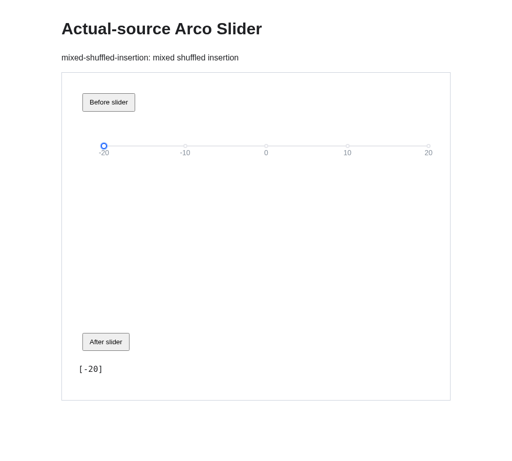
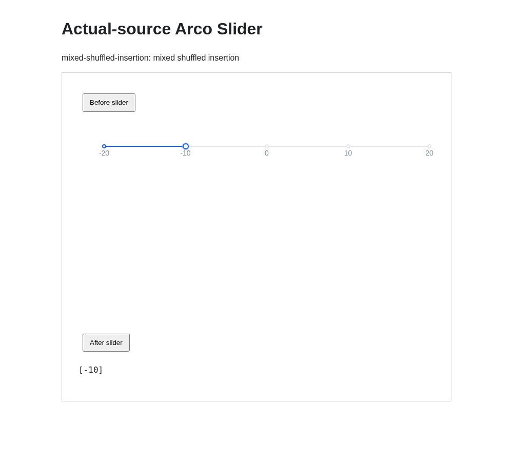

# Arco Slider negative-mark keyboard evidence

The same scalar Slider starts at `-20` with `onlyMarkValue` enabled, bounds `[-20, 20]`, and shuffled mixed-sign integer marks. These untouched screenshots show the first trusted `ArrowRight` press:

- Baseline: thumb remains at `-20`; emitted value is `-20`.
- Fixed: thumb moves to the next numeric mark, `-10`; emitted value is `-10`.

The array printed below the Slider is its `onChange` emission history. This is a single-thumb Slider, not a range value.

## Baseline

## Fixed

## Provenance

- [Official paired browser run](https://github.com/dvd233/arco-design/actions/runs/37504387965), attempt 1; Chromium `141.0.7390.37`.
- [Baseline source](https://github.com/arco-design/arco-design/commit/c2b050d9c7ce94bebba94f616a0721344231caac).
- [Fixed source](https://github.com/dvd233/arco-design/commit/a1ea1670c162248348515ddfa14e445860bb3c22).
- Scenario: `mixed-shuffled-insertion`, checkpoint 1. Actual component source and original native CSS were built separately for each side.
- The complete paired run covers 19 scenarios and 117 checkpoints per side; these two images illustrate one checkpoint.
- Original artifact ZIP SHA-256: `4db8d65d193341867c1d26b2326c21eec49db6399880fb1f5893c6b9b2ef5bc6`.
- `baseline.png` SHA-256: `fa08bb748169ae9df6f6939271e4f62cf6b24c177458c18755cac4c02757e7eb`.
- `fixed.png` SHA-256: `b87dab58c54f1b803e9d033b8b0206965b6c62deb21f14e2b9772af08b8ea115`.
